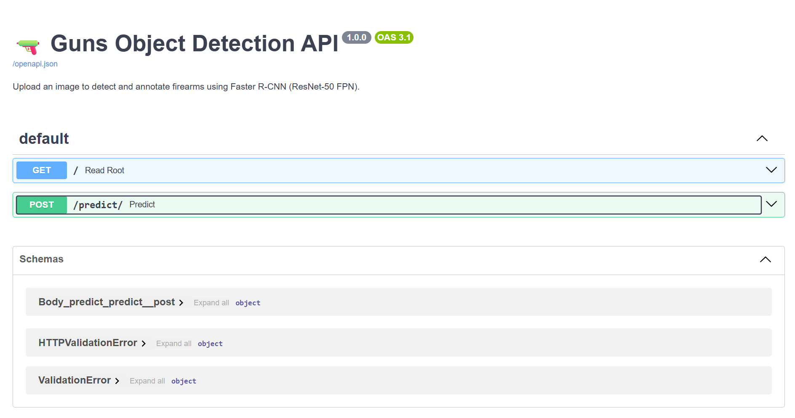
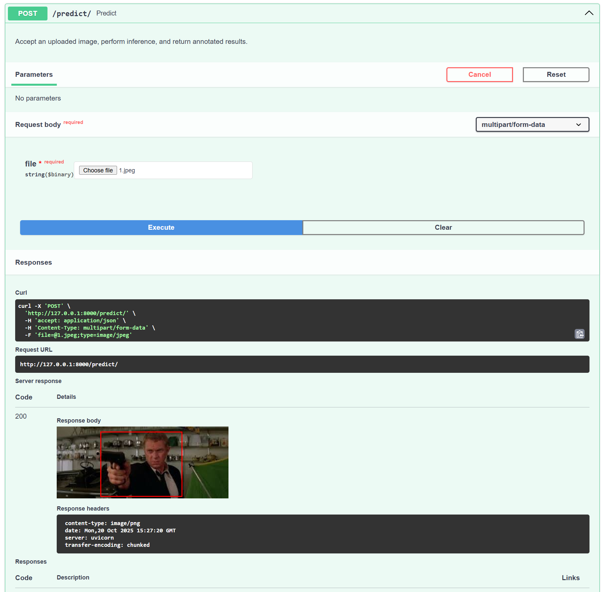
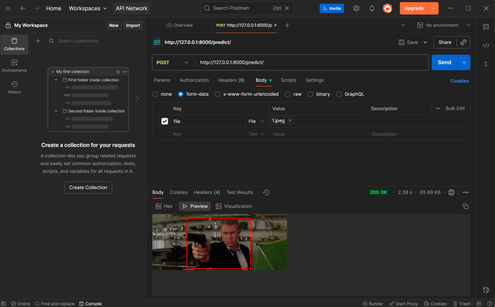

# ⚡ **API Deployment — FastAPI, Swagger UI & Postman**

This branch introduces the **API Deployment stage** of the **MLOps Gun Detection** pipeline.  
Here, we transform the trained Faster R-CNN model into a **production-ready REST API** using **FastAPI**, enabling users to upload images and receive annotated predictions in real time.

The API provides two endpoints:

| Method | Endpoint      | Description |
| :------ | :------------- | :------------ |
| `GET`   | `/`            | Basic API health check |
| `POST`  | `/predict/`    | Upload an image and return detection results |


## 🧾 **What This Stage Includes**

* ✅ `main.py` — FastAPI server exposing the inference endpoint  
* ✅ Integration of pretrained **Faster R-CNN (ResNet-50 FPN)**  
* ✅ Automatic documentation via **Swagger UI**  
* ✅ Endpoint validation using **Postman**  
* ✅ Complete end-to-end local inference test flow  

This marks the transition from **model training** to **real-time model serving**, laying the groundwork for scalable inference and API-based deployment.


## 🧠 **Creating the API**

We start by creating a new file called `main.py` in the project root.

```bash
mlops-gun-detection/
├── main.py                   # 🚀 FastAPI inference API
├── src/                      # Core modules
├── artifacts/                # Models, images, and labels
└── img/
    └── api_deployment/
````

Inside `main.py`, we implemented a **FastAPI** app that loads a pretrained **Faster R-CNN (ResNet-50 FPN)** model, processes uploaded images, and returns them annotated with bounding boxes.
The API automatically detects available GPU/CPU and performs inference using PyTorch.


## ⚙️ **Run the FastAPI Server**

Open a terminal in the project root and run:

```bash
uvicorn main:app --reload
```

You’ll see console output indicating the API has started:

```
INFO:     Uvicorn running on http://127.0.0.1:8000 (Press CTRL+C to quit)
```

Then, open your browser and navigate to:

👉 **[http://127.0.0.1:8000/docs#/](http://127.0.0.1:8000/docs#/)**

This will open the **Swagger UI** interface, where you can interact with the API directly.


## 🧪 **Testing with Swagger UI**

### 1️⃣ Access the API Docs

Once the server is running, open:

> **[http://127.0.0.1:8000/docs#/](http://127.0.0.1:8000/docs#/)**

You’ll see the FastAPI Swagger interface:




### 2️⃣ Test the `/predict/` Endpoint

* Expand the `POST /predict/` dropdown
* Click **“Try it out”**
* You’ll now see an upload panel under the *Request Body* section

Upload any test image from your project (e.g., from `artifacts/raw/Images/`)
Then click **“Execute”** — you’ll see a preview of the API response:



The response is an annotated image stream showing red bounding boxes for detected firearms.


## 🧩 **Testing with Postman**

You can also test the same endpoint using **Postman** — ideal for API debugging and integration testing.

### 1️⃣ Download and Set Up Postman

Go to 👉 [https://www.postman.com/downloads/](https://www.postman.com/downloads/)
Install the desktop application and sign in (free account works fine).


### 2️⃣ Create a New Request

* Open Postman and create a **New Workspace**
* Click the **“+”** tab beside *Overview* to open a new request tab
* Change the request type to **POST**
* Set the URL to:

```
http://127.0.0.1:8000/predict/
```


### 3️⃣ Configure the Request Body

* Select the **Body** tab
* Choose **form-data**
* Under **Key**, enter `file`
* On the right, change the *Text* dropdown to **File**
* Under **Value**, upload one of your training images (e.g., from `artifacts/raw/Images/`)

Then click **Send** — the API will return the annotated image as the response:




## 🧠 **Outputs**

| Output                     | Description                                                       |
| :------------------------- | :---------------------------------------------------------------- |
| **Annotated Image**        | Uploaded image returned with red bounding boxes for detected guns |
| **Swagger UI Interface**   | Auto-generated FastAPI docs for interactive testing               |
| **Postman Test Workspace** | Manual API test confirming inference functionality                |
| **main.py**                | Production-ready FastAPI app for inference deployment             |


## 🗂️ **Project Structure (Delta)**

```
mlops-gun-detection/
├── main.py                     # FastAPI inference API
├── artifacts/
│   ├── models/                 # Trained model weights
│   └── raw/                    # Dataset (Images + Labels)
├── img/
│   └── api_deployment/
│       ├── fastapi_ui.png
│       ├── fastapi_predict.png
│       └── postman_ui_predict.png
```

## 🏁 **Project Conclusion — MLOps Gun Detection**

This stage marks the completion of the **MLOps Gun Detection** project — a fully modular, end-to-end machine learning workflow that progresses from **data ingestion** to **real-time inference**.

Through each branch and stage, we have built a structured, reproducible system encompassing:

* ⚙️ **Automated data ingestion** from Kaggle via KaggleHub  
* 🧹 **Data preprocessing and validation** with custom PyTorch datasets  
* 🧠 **Model architecture definition** using Faster R-CNN (ResNet-50 FPN)  
* 🔥 **Training orchestration and logging** with TensorBoard  
* ⚡ **API deployment** for live inference using FastAPI, Swagger UI, and Postman  

Each stage was designed to mirror real-world MLOps workflows — from experimentation and tracking to reproducible pipelines and model serving.

## 🚀 **Next Steps & Extensions**

While this project is now complete, several natural extensions could follow:

* 🐳 **Containerisation** — Package the FastAPI app into a Docker image for deployment.  
* ☁️ **Cloud Deployment** — Deploy the container on AWS, Azure, or GCP for scalable access.  
* 📈 **Monitoring & Retraining** — Integrate Prometheus or MLflow for production tracking and continuous model improvement.  
* 🔍 **Model Evaluation** — Expand metrics (mAP, precision, recall) for deeper performance insight.  

## 🧩 **Summary**

This project demonstrates a full **MLOps lifecycle** applied to a real object detection problem:
> From raw data ➜ reproducible pipelines ➜ trained model ➜ deployed API.

It serves as a robust, modular foundation for more advanced computer vision systems — ready to be scaled, containerised, and deployed to production.

🎯 **End of Project — MLOps Gun Detection**
